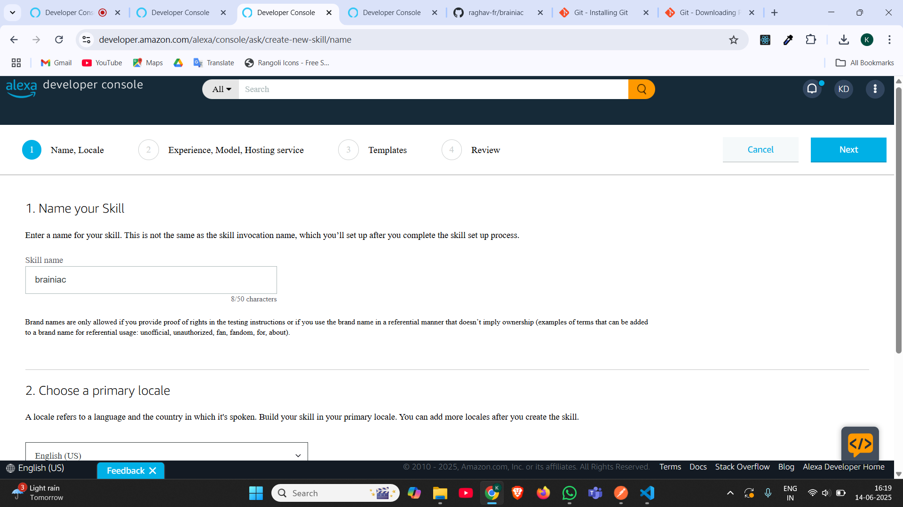
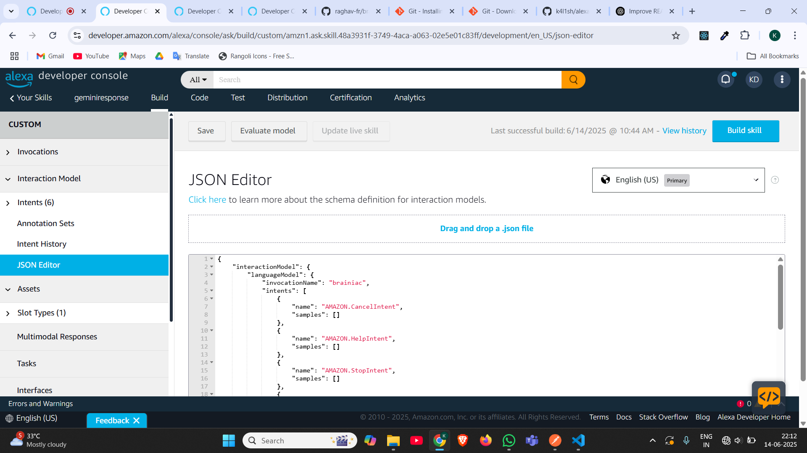
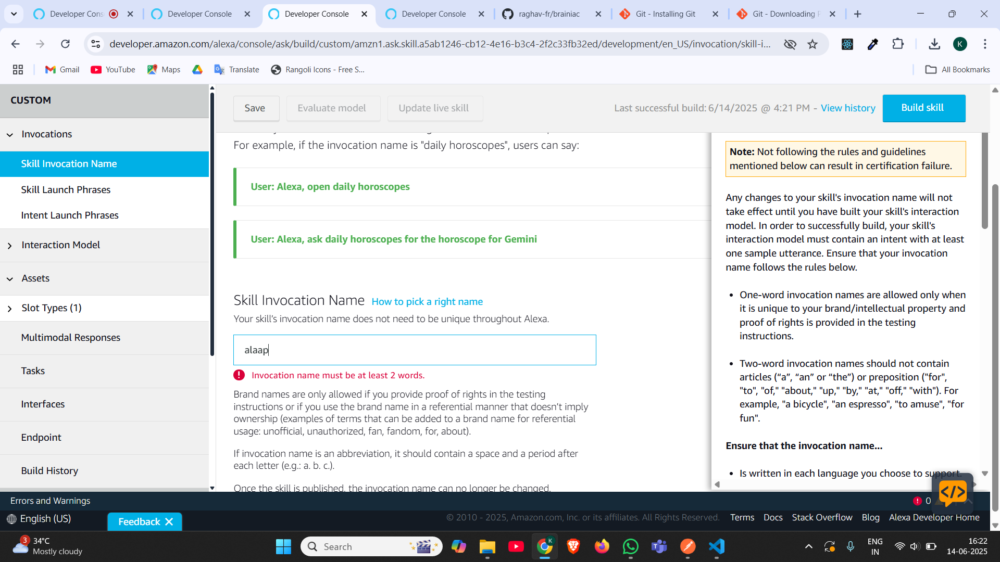

# 🧠 Brainiac – Alexa Skill

**Brainiac** is a custom Alexa skill that enables users to interact with an intelligent AI assistant using voice commands. This guide walks you through the setup process using the Alexa Developer Console.

---

## 🚀 How to Set It Up

### 1. Log In

- Go to the [Alexa Developer Console](https://developer.amazon.com/alexa/console/ask).
- Log in using your Amazon Developer account.


---

### 2. Create a New Skill

- Click **"Create Skill"**.
- Enter the skill name: `brainiac`.
- Choose the **primary locale** (e.g., `en-US`).
  

- For the model, select:
  - **"Other" → "Custom"**
- For backend resources, select:
  - **"Alexa-hosted (Node.js)"**
    
    

---

### 3. Choose Setup Method

#### Option A – Import Skill

- Click **"Import Skill"**
- Paste the repository URL:
  ```
  https://github.com/raghav-fr/brainiac.git
  ```
- Click **"Import"**
  
  After importing this loader will open and let it finish.

#### Option B – Manual Setup

1. Choose **"Start from Scratch"** and click **"Create Skill"**.
2. Navigate to the **"Build"** section.
3. Open the **"JSON Editor"** tab.
4. Replace the existing JSON content with the provided JSON configuration.
   

```json
{
  "interactionModel": {
    "languageModel": {
      "invocationName": "brainiac",
      "intents": [
        {
          "name": "AMAZON.CancelIntent",
          "samples": []
        },
        {
          "name": "AMAZON.HelpIntent",
          "samples": []
        },
        {
          "name": "AMAZON.StopIntent",
          "samples": []
        },
        {
          "name": "AMAZON.FallbackIntent",
          "samples": []
        },
        {
          "name": "AskLLMIntent",
          "slots": [
            {
              "name": "query",
              "type": "AMAZON.SearchQuery"
            }
          ],
          "samples": [
            "get {query}",
            "tell {query}",
            "explain {query}",
            "what is {query}",
            "ask brainiac {query}",
            "tell brainiac {query}",
            "get from brainiac {query}",
            "brainiac {query}",
            "can you tell brainiac {query}",
            "brainiac tell me {query}",
            "ask brainiac to {query}",
            "hey brainiac {query}",
            "start brainiac and {query}",
            "open brainiac and {query}"
          ]
        },
        {
          "name": "AMAZON.NavigateHomeIntent",
          "samples": []
        }
      ],
      "types": []
    }
  }
}
```

5. Change the `"invocationName"` to `"brainiac"` or any custom name you'd like to use to activate the skill.
   

---

### 4. Build the Model

- Click **"Save Model"**
- Then click **"Build Model"**

---

### 5. Add Code

- Go to the **"Code"** tab.

#### 🔧 Update `package.json`

Replace its content with:

```json
{
  "name": "hello-world",
  "version": "1.2.0",
  "description": "alexa utility for quickly building skills",
  "main": "index.js",
  "scripts": {
    "test": "echo \"Error: no test specified\" && exit 1"
  },
  "author": "Amazon Alexa",
  "license": "Apache License",
  "dependencies": {
    "ask-sdk-core": "^2.7.0",
    "ask-sdk-model": "^1.19.0",
    "aws-sdk": "^2.326.0",
    "axios": "^1.6.8",
    "form-data": "^4.0.0"
  }
}
```

#### 🧠 Replace `index.js`

Replace the `index.js` content with your Alexa skill logic. Here's a basic template:

```js
const Alexa = require("ask-sdk-core");
const axios = require("axios");
const FormData = require("form-data");

// Call your custom API with form-data
const getCustomAPIResponse = async (query) => {
  const url = "https://test.aptilab.in/api/process/test/gem/";

  const form = new FormData();
  form.append("query", query);

  const response = await axios.post(url, form, {
    headers: form.getHeaders(),
  });

  return response.data.data.data; // Assumes structure { data: { data: "<reply>" } }
};

const LaunchRequestHandler = {
  canHandle(handlerInput) {
    return (
      Alexa.getRequestType(handlerInput.requestEnvelope) === "LaunchRequest"
    );
  },
  handle(handlerInput) {
    const speakOutput = "Hi! You can ask me anything. Go ahead.";
    return handlerInput.responseBuilder
      .speak(speakOutput)
      .reprompt("Please say something.")
      .getResponse();
  },
};

const AskLLMIntentHandler = {
  canHandle(handlerInput) {
    return (
      Alexa.getRequestType(handlerInput.requestEnvelope) === "IntentRequest" &&
      Alexa.getIntentName(handlerInput.requestEnvelope) === "AskLLMIntent"
    );
  },
  async handle(handlerInput) {
    const query = handlerInput.requestEnvelope.request.intent.slots.query.value;
    let reply;

    try {
      reply = await getCustomAPIResponse(query);
    } catch (error) {
      console.error("API error:", error);
      reply = "Sorry, I couldn't get an answer right now.";
    }

    return handlerInput.responseBuilder
      .speak(reply)
      .reprompt("Do you want to ask something else?")
      .getResponse();
  },
};

const HelpIntentHandler = {
  canHandle(handlerInput) {
    return (
      Alexa.getRequestType(handlerInput.requestEnvelope) === "IntentRequest" &&
      Alexa.getIntentName(handlerInput.requestEnvelope) === "AMAZON.HelpIntent"
    );
  },
  handle(handlerInput) {
    const speakOutput = "You can say, ask Alaap who is Einstein.";
    return handlerInput.responseBuilder
      .speak(speakOutput)
      .reprompt(speakOutput)
      .getResponse();
  },
};

const CancelAndStopIntentHandler = {
  canHandle(handlerInput) {
    return (
      Alexa.getRequestType(handlerInput.requestEnvelope) === "IntentRequest" &&
      (Alexa.getIntentName(handlerInput.requestEnvelope) ===
        "AMAZON.CancelIntent" ||
        Alexa.getIntentName(handlerInput.requestEnvelope) ===
          "AMAZON.StopIntent")
    );
  },
  handle(handlerInput) {
    return handlerInput.responseBuilder.speak("Goodbye!").getResponse();
  },
};

const FallbackIntentHandler = {
  canHandle(handlerInput) {
    return (
      Alexa.getRequestType(handlerInput.requestEnvelope) === "IntentRequest" &&
      Alexa.getIntentName(handlerInput.requestEnvelope) ===
        "AMAZON.FallbackIntent"
    );
  },
  handle(handlerInput) {
    return handlerInput.responseBuilder
      .speak("Sorry, I didn't understand that. Please try again.")
      .reprompt("Please say that again.")
      .getResponse();
  },
};

const SessionEndedRequestHandler = {
  canHandle(handlerInput) {
    return (
      Alexa.getRequestType(handlerInput.requestEnvelope) ===
      "SessionEndedRequest"
    );
  },
  handle(handlerInput) {
    return handlerInput.responseBuilder.getResponse();
  },
};

const ErrorHandler = {
  canHandle() {
    return true;
  },
  handle(handlerInput, error) {
    console.error("Error handled:", error);
    return handlerInput.responseBuilder
      .speak("Sorry, something went wrong.")
      .reprompt("Please try again.")
      .getResponse();
  },
};

exports.handler = Alexa.SkillBuilders.custom()
  .addRequestHandlers(
    LaunchRequestHandler,
    AskLLMIntentHandler,
    HelpIntentHandler,
    CancelAndStopIntentHandler,
    FallbackIntentHandler,
    SessionEndedRequestHandler
  )
  .addErrorHandlers(ErrorHandler)
  .lambda();
```

---

### 6. Save and Deploy

- Click **"Save"**
- Click **"Deploy"**

---

### 7. Test the Skill

- Go to the **"Test"** tab.
- Enable **"Skill testing in development"**.
- Test by saying:

```
Alexa, open brainiac
```

---

## 📱 How to Set Up the Alexa App on Android for the Skill

To interact with your custom Brainiac Alexa skill using your Android device, follow these steps:

1. **Install the Alexa App**

   - Download and install the [Amazon Alexa app](https://play.google.com/store/apps/details?id=com.amazon.dee.app) from the Google Play Store.

2. **Log In with Your Amazon Account**

   - Use the same Amazon Developer account you used to create the skill.

3. **Enable Skill in app**

   - In the Alexa app, go to:
   **Home → getting started with alexa → Discover more → Your Skills**
   <p align="left">
   
   
   </p>
   - Navigate to **dev**

   <p align="left">
   
   </p>
   - Find your Skill -> click Enable skill
    <p align="left">
   
   </p>

4. **Use Your Skill**
   - After deploying your skill from the Alexa Developer Console, say:
     ```
     Alexa, open brainiac
     ```
   - You can now interact with the skill directly through your Android phone.

## 📞 Need Help?

- 📧 Open an issue on GitHub
- 💬 Ask questions in discussions
- ⭐️ Star the repo if you found it helpful!

---

## 🧪 Sample Invocation

```bash
open brainiac
```

---
